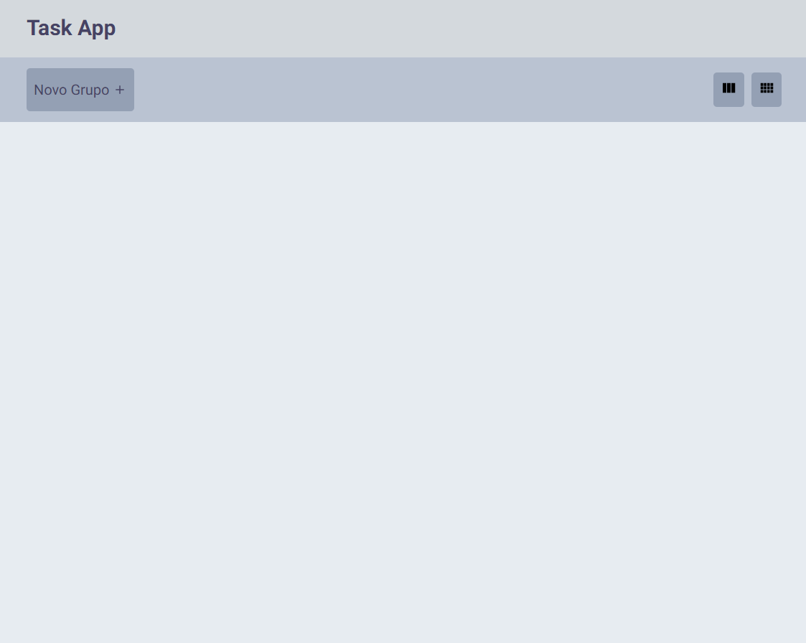
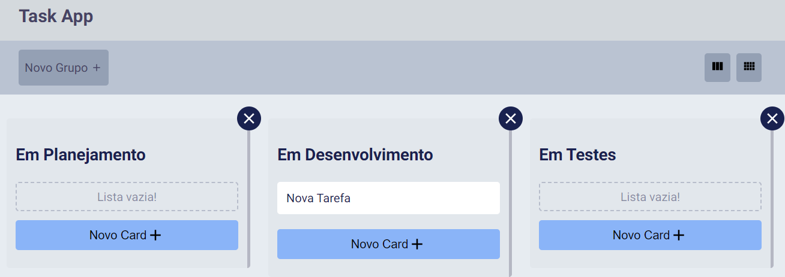
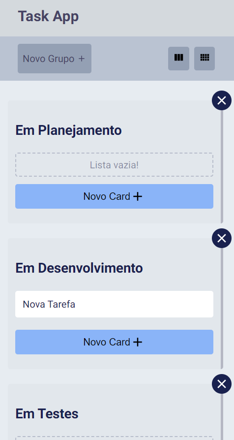
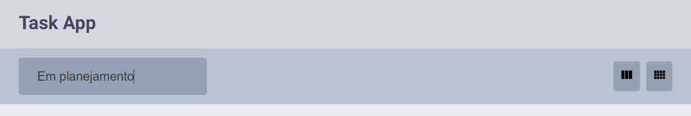
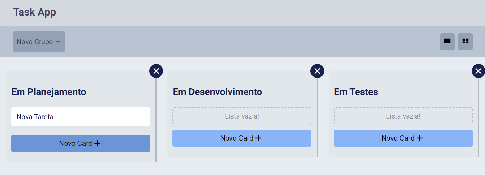
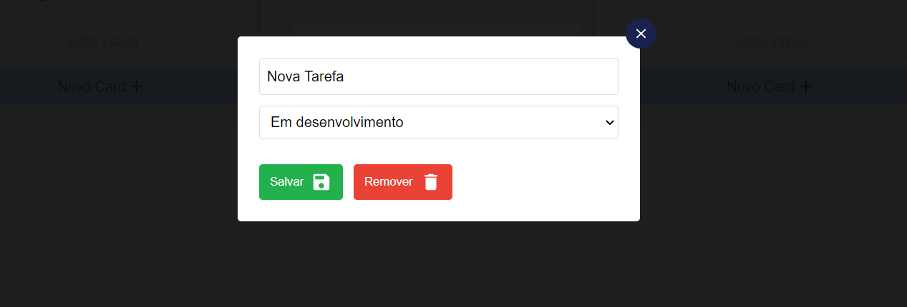
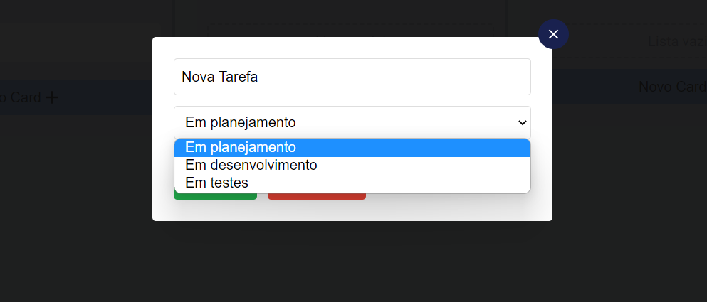

# Task App
Um modelo de app para gerenciamento de tarefas feito com React

## Tecnologias Utilizadas
* HTML
* CSS
* JS
* React
* React-icons

## Inrterface

### Visão Default

### Visão com grupos criados

### Visão mobile

## Funcionalidades

#### Adicionar novo grupo de tarefas
Ao clicar sobre o botão "Novo Grupo" é possível adicionar um novo grupo de tarefas informando o seu respectivo nome.

#### Adicionar nova tarefa
Ao clicar sobre o botão "Novo Card", dentro de um grupo, é possível adicionar uma nova tarefa ao grupo.

#### Editar tarefa
Ao clicar sobre uma deteminada tarefa aparecerá um Pop-up contendo campos que permitirão editar a mesma. Depois de fazer as modificações basta clicar no botão "Salvar". Para sair sem que nenhuma alteração seja realizada clique no botão X que fecha o Pop-up.

#### Mudar o estado da tarefa
Para mover uma tarefa para um outro grupo clique sobre ela para abrir o Pop-up de edição. Após isso selecione no menu de opções o grupo para qual a tarefa deverá ser movida. Para confirmar as alterações clique em "Salvar".

### Remover tarefa
Para remover uma tarefa clique sobre ela e no Pop-up de edição clique em "Remover".

### Remover grupo de opções
Para  remover um grupo de tarefas clique sobre o botão X localizado no canto superior direito a cada grupo de tarefas.
